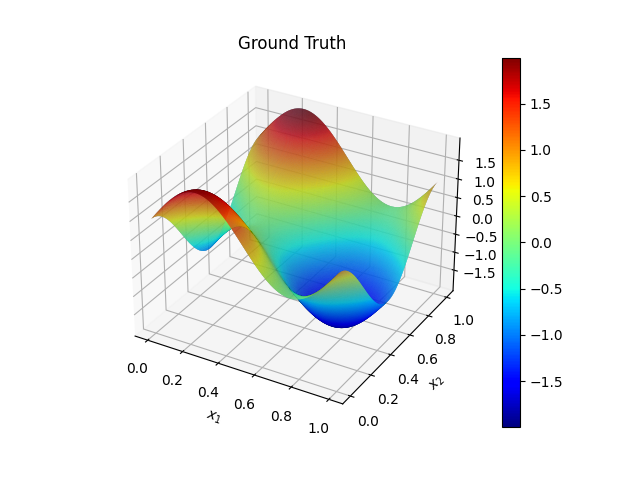

# ALKIA-X
ALKIA-X, the **A**daptive and **L**ocalized **K**ernel **I**nterpolation **A**lgorithm with e**X**trapolated reproducing kernel Hilbert space norm, is an algorithm to automatically approximate black-box functions. 
ALKIA-X ensures:
* A fast-to-evaluate approximating function;
* The guaranteed satisfaction of the desired bound on the approximation error;
* Well-conditioned computations;
* High level of parallelization.
  
We highlight the benefits of ALKIA-X by automatically approximating nonlinear model predictive control (MPC) schemes with closed-loop guarantees. 
Please refer to [1] to cite this code.

# Dependencies

* Python
* [CasADi](https://web.casadi.org/) and [IPOPT](https://coin-or.github.io/Ipopt/) for MPC problems

$1+1=2$

# Setup
Create a conda environment 
```
conda create --name ALKIAX
```
and install the following packages:
```
pip install scikit-learn
pip install casadi
pip install tqdm
```

# Toy example
The current repository has three pre-implemented toy examples to test ALKIA-X on. 
One of the toy examples is a two-dimensional sinusoide $f{:} [0,1]^2\subseteq\mathbb{R}^2\rightarrow \mathbb{R}$
$$f(x) = \sin(2\pi x_1)+ \cos(2\pi x_2),$$ with $x=[x_1,x_2]^\top.$
The following figure shows the ground truth function evaluated on $90\cdot 10^3$ equidistant inputs.





To execute the toy experiment, use, the following hyperparameters in the ALKIAX_main.py file:
```python
epsilon = 5e-3  # max allowed error
round_n_digits = 14  # rounding
gt_string = 'sine_2D'
x_dim, y_dim = ground_truth_dimensions(gt_string)
number_of_head_nodes = 1
p_min = 2
cond_max = 1.15e8
C_ell = 0.8
kernel = matern_kernel(sigma=1, ell=C_ell, nu=3/2)
parallel = True
max_storage_termination = np.infty
```
The epsilon-hyperparameter is the a priori guaranteed maximum approximation error. 
Decreasing that value will increase the time required to generate the approximation (and vice versa).
At the end of the ALKIAX_main.py file, select a name to save the pickle file, e.g.:
```python
with open('C_root_sine_2D.pickle', 'wb') as handle:
    pickle.dump(C_root, handle, protocol=pickle.HIGHEST_PROTOCOL)


# Reproducing experiments of the paper
## CSTR
To reproduce the approximation of the MPC scheme for the continious stirred tank reactor, use the following hyperparameters in the ALKIAX_main.py file:
```python
epsilon = 5.1e-3
round_n_digits = 14
gt_string = 'CSTR_python'
x_dim, y_dim = ground_truth_dimensions(gt_string)
number_of_head_nodes = 5**2
p_min = 2
cond_max = 1.2e8
C_ell = 0.8
kernel = matern_kernel(sigma=1, ell=C_ell, nu=3/2)
parallel = True
max_storage_termination = np.infty
```

## Cold atmospheric plasma
To reproduce the approximation of the MPC scheme for the cold atmospheric plasma device, use the following hyperparameters in the ALKIAX_main.py file:
```python
epsilon = 1e-6
round_n_digits = 14
gt_string = 'plasma_python'
x_dim, y_dim = ground_truth_dimensions(gt_string)
number_of_head_nodes = 3**3
p_min = 2
cond_max = 3.4e7
C_ell = 0.8
kernel = matern_kernel(sigma=1, ell=C_ell, nu=3/2)
parallel = True
max_storage_termination = 75
```

Then, run ALKIA-X as follows:
You can run ALKIA-X as follows:
```
conda activate ALKIAX
taskset -c 1,2,3,4,5,6,7,8 python ALKIAX_main.py
```
This exact line will lead to a parallelization on CPU cores 1-8.

## Using pre-trained approximations 
The pre-trained pickle files for the continous stirred tank reactor or the cold atmospheric plasma device are "CSTR_final.pickle" and "plasma_final.pickle", respectively.


## Post-processing


#
[1] Abdullah Tokmak, Christian Fiedler, Melanie N. Zeilinger, Sebastian Trimpe, Johannes Köhler, "[Automatic nonlinear MPC approximation with closed-loop guarantees](https://arxiv.org/pdf/2312.10199.pdf)," arXiv preprint arXiv:2312.10199, 2023.


